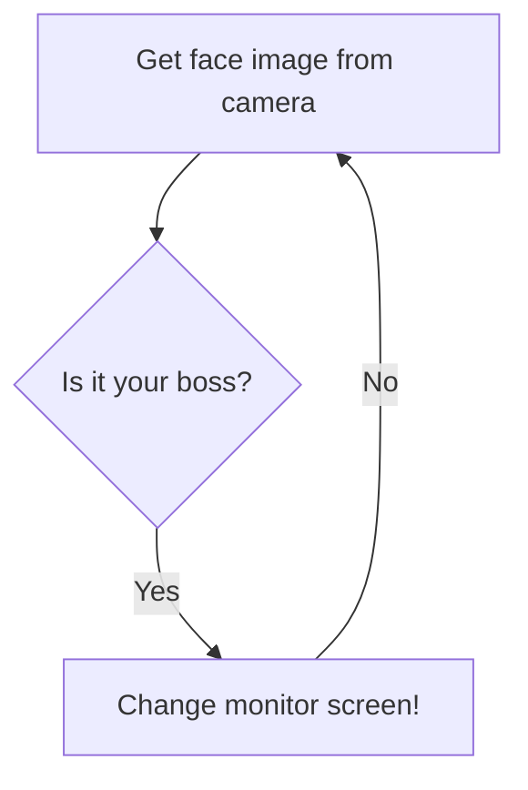

## Boss detector using facial recognition

Change your monitor screen when your boss is coming towards you!

[](https://www.python.org/downloads/release/python-360/)
[](http://unmaintained.tech/)

<br/>



A program that detects when your boss is approaching and changes the computer screen instantly. It uses the classical LBPH algorithm for facial recognition. Initially the system is training with the boss's face. When boss is detected, the interface changes the computer screen. It is a fun way to implement facial recognition! Video demo [here](https://www.youtube.com/watch?v=17ElyWwVVdk).


</p>
<br/>

## Demo

Boss is approaching. Here, I am the boss, since my boss is out of the country, literally!


As he is approaches, the program fetches face images and classifies the image.


If the image is classified as the Boss, it will change the computer screen.


That's how you become employee of the month!

## PREREQUISITES
- Python 3.6
- OpenCV 3+

## Packages and dependencies
* virtualenv
* cv
* numpy
* PIL (pillow)
* tkinter

## Usage

Firstly, setup the virtual environment and train the program for your boss.
```
$ venv\Scripts\activate.bat
$ python boss_train.py
```
Second, start the boss detector.
```
$ python boss-detector.py
```
## Takeaways

* To use this, place your webcam at a position where you know your boss will come in that region. Works well even when boss is six to seven feet away from the camera

* Double check training images, xml file path(s) before running the program

* Delete contents inside the data folder to make new changes if any.

## Video Demo
Click [here](https://www.youtube.com/watch?v=17ElyWwVVdk&feature=youtu.be) for the demo.

## Contributing
There is still scope of improvement in this project. Most welcome to send pull requests. All the the best, being a good employee!
## License
[MIT](https://github.com/hasibzunair/boss-detector/blob/master/LICENSE)

## Author
[Hasib Zunair](http://hasibzunair.github.io/)

